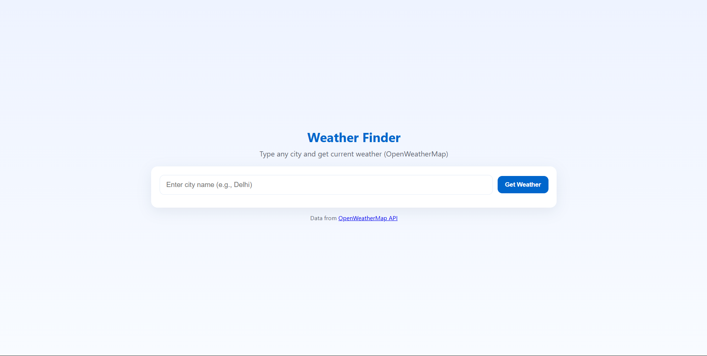
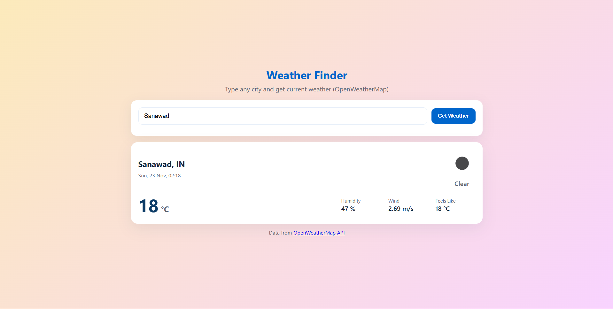

<h1>🌦 Weather App</h1>

<b>Real-Time Weather Updates with Dynamic Background UI</b>

<h2>📌 Overview</h2>

A modern and responsive weather application that fetches real-time weather data using the OpenWeatherMap API. 
Users can search any city and instantly get temperature, weather condition, humidity, and wind details.

✨ The standout feature is its <b>dynamic background</b> that changes based on temperature and weather conditions, making the experience visually engaging and interactive.

<h2>🚀 Features</h2>

<ul>
  <li>🔍 Search weather by city name</li>
  <li>🌡 Displays temperature in °C</li>
  <li>🌤 Shows weather condition & icon</li>
  <li>🌈 Dynamic background based on weather</li>
  <li>⚠ Error handling for invalid city names</li>
  <li>📱 Fully responsive design</li>
  <li>⚡ Fast and smooth performance</li>
</ul>

<h2>📸 Screenshots</h2>

  
  

<h2>🛠 Tech Stack</h2>

HTML5 • CSS3 • JavaScript (ES6+) • OpenWeatherMap API

<h2>🌐 API Used</h2>

<a href="https://openweathermap.org/api">OpenWeatherMap API</a>

<pre>
https://api.openweathermap.org/data/2.5/weather?q={CITY_NAME}&appid={API_KEY}&units=metric
</pre>

<h2>📁 Project Structure</h2>

<pre>
weather-app/
│── index.html
│── style.css
│── script.js
└── screenshots/
       home.png
       result.png
</pre>

<h2>📦 Installation</h2>

<pre>
git clone https://github.com/Mantshakhan10/Weather-App.git
</pre>

Open <b>index.html</b> in your browser and start using the app.

<h3>✨ Made with ❤️ by Mantsha Khan</h3>

